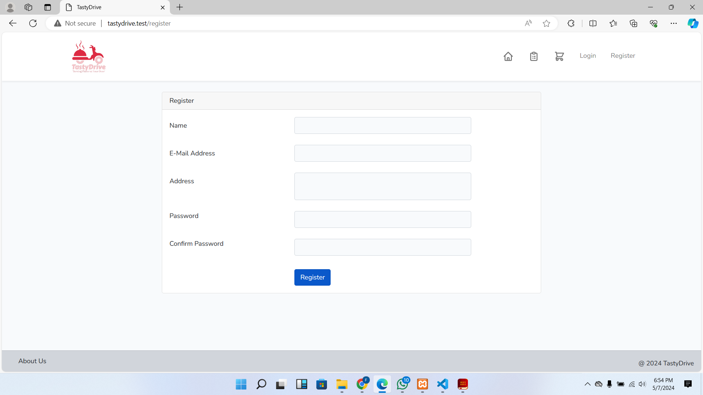
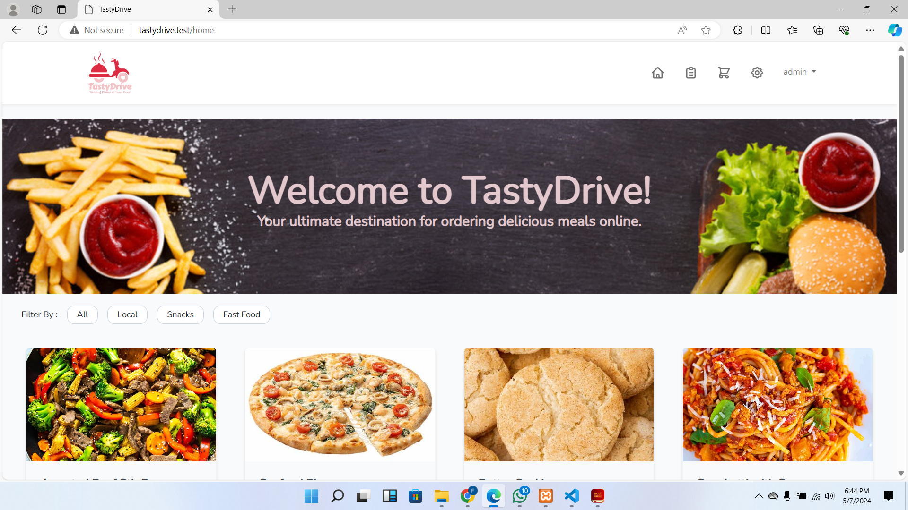
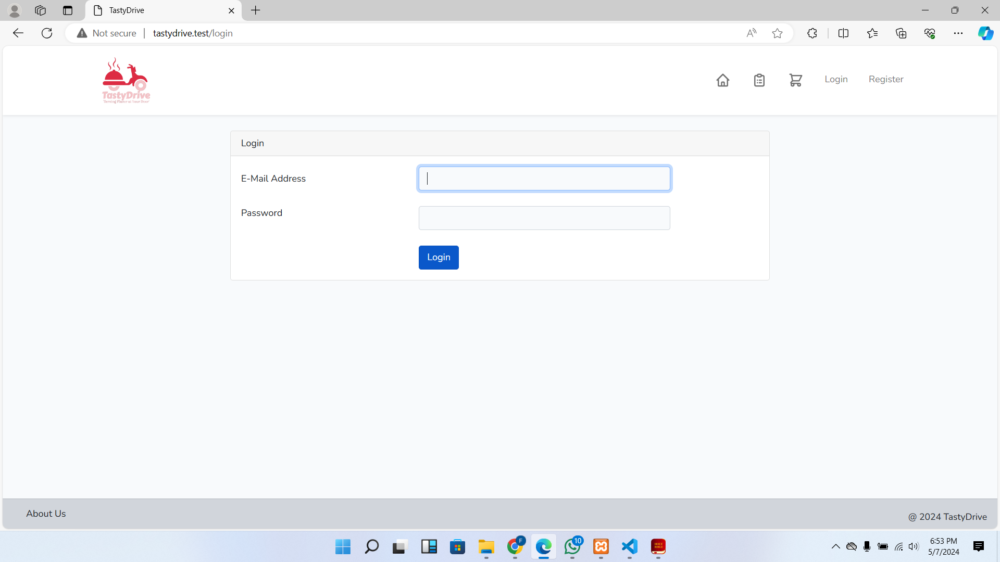

## Table of Contents

1. [Introduction](#introduction)
2. [Contributors](#contributors)
3. [Features](#features)
4. [Technologies Used](#technologies-used)
5. [Installation and Setup](#installation-and-setup)
   - [Prerequisites](#prerequisites)
   - [Installation Steps](#installation-steps)
6. [Usage](#usage)
7. [Contributing](#contributing)
8. [License](#license)
9. [Acknowledgments](#acknowledgments)
10. [Application Screenshots](#screenshots)

---

## Introduction <a name="introduction"></a>

TastyDrive is a collaborative web-based food ordering application developed as a final portfolio project by Matilda Dogbatsey, Freda Tsorme-Dzebu, and Rosina Antwi during their ALX program. The application showcases efforts in UI/UX design, frontend and backend development, database integration, and project management.

## Contributors <a name="contributors"></a>

- **Matilda Dogbatsey**
  - UI/UX Design
  - Logo Design
  - Page Design
  - Image Assets

- **Freda Tsorme-Dzebu**
  - Database Management
  - Frontend-Backend Integration
  - Feature Implementation

- **Rosina Antwi**
  - Model Design
  - Backend Development
  - Project Management

## Features <a name="features"></a>

- **User Authentication**:
  - Secure registration and login.
  - Password reset via email.

- **Menu Management**:
  - Admin dashboard for CRUD operations on food items.
  - Categorization of food items.

- **Order Placement**:
  - Browse menu, add items to cart, and checkout.
  - View order history.

- **Admin Dashboard**:
  - Manage food items.

## Technologies Used <a name="technologies-used"></a>

<div align="left">
<!-- Laravel Logo -->
<div style="display: inline-block; margin-right: 20px;">
  
  <p style="font-size: 12px; margin-top: 5px;">Laravel Framework</p>
</div>
<!-- MySQL Logo -->
<div style="display: inline-block; margin-right: 20px;">
  
  <p style="font-size: 12px; margin-top: 5px;">MySQL Database</p>
</div>
<!-- HTML/CSS/JavaScript Logo -->
<div style="display: inline-block; margin-right: 20px;">
  
  <p style="font-size: 12px; margin-top: 5px;">HTML/CSS/JavaScript</p>
</div>
<!-- Bootstrap Logo -->
<div style="display: inline-block; margin-right: 20px;">
  
  <p style="font-size: 12px; margin-top: 5px;">Bootstrap</p>
</div>
<!-- Git Logo -->
<div style="display: inline-block; margin-right: 20px;">
  
  <p style="font-size: 12px; margin-top: 5px;">Git</p>
</div>
<!-- Composer Logo -->
<div style="display: inline-block;">
  
  <p style="font-size: 12px; margin-top: 5px;">Composer</p>
</div>
</div>
### Prerequisites <a name="prerequisites"></a>

- PHP (7.x or higher)
- Composer
- MySQL database

### Installation Steps <a name="installation-steps"></a>

1. **Clone the Repository**:
   ```bash
   git clone https://github.com/yourusername/TastyDrive.git
   cd TastyDrive
   ```

2. **Install Dependencies**:
   ```bash
   composer install
   ```

3. **Set Environment Variables**:
   - Duplicate `.env.example` to `.env`.
   - Update `.env` with your database configuration.

4. **Generate Application Key**:
   ```bash
   php artisan key:generate
   ```

5. **Run Migrations**:
   ```bash
   php artisan migrate
   ```

6. **Start Development Server**:
   ```bash
   php artisan serve
   ```

   Access the application at `http://localhost:8000` in your web browser.

## Usage <a name="usage"></a>

- **User Registration**:
  - Navigate to `/register` to create an account.

- **Admin Access**:
  - Update `is_admin` in `users` table to grant admin privileges.

- **Admin Dashboard**:
  - Access `/admin` to manage menu items and orders.

- **Placing Orders**:
  - Browse menu, add items to cart, and checkout.

## Contributing <a name="contributing"></a>

Contributions to TastyDrive are welcome! Follow these steps:

1. Fork the repository.
2. Create a new branch (`git checkout -b feature/my-feature`).
3. Commit your changes (`git commit -am 'Add new feature'`).
4. Push to the branch (`git push origin feature/my-feature`).
5. Create a new Pull Request.

## License <a name="license"></a>

This project is licensed under the MIT License.

## Acknowledgments <a name="acknowledgments"></a>

- ALX Final Project
- Laravel Documentation: [https://laravel.com/docs](https://laravel.com/docs)
- Bootstrap Documentation: [https://getbootstrap.com/docs](https://getbootstrap.com/docs)

It looks like you want to incorporate images into your project documentation to enhance its presentation. Including images can make your documentation more engaging and visually appealing. Here's how you can incorporate images into different sections of your documentation:


 ## Application Screenshots <a name="screenshots"></a>

- **User Registration Page**
  

- **Admin Dashboard**
  
- **Login Page**
  
